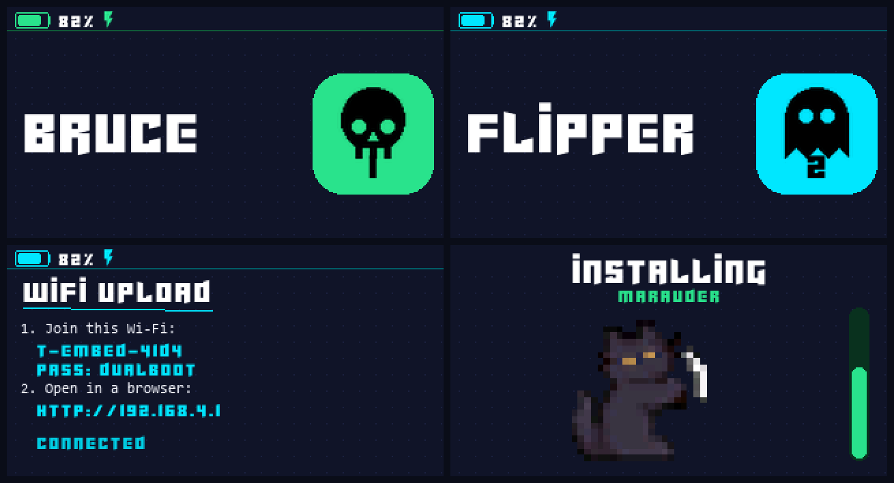

# Dual-Boot Launcher — LilyGo T-Embed CC1101

A clean, PIN-lockable **launcher firmware** for the LilyGo **T-Embed CC1101** (ESP32-S3).
The device always boots into the launcher first; from there you install and run any ESP32-S3
firmware (Bruce, Flipper-style tools, Marauder, your own builds…) straight from the SD card.
Nothing but the launcher ships on the device — you add the rest.



> The screens above are rendered previews of the on-device UI (320×170 display).

---

## Features

- **Launcher-first boot.** A custom 2nd-stage bootloader always returns to the launcher on a
  normal reset, so you can never get "locked into" an installed app — power-cycle and you're back.
- **Install firmware from the SD card.** Drop any `.bin` in the card root, pick a slot, name it,
  done. Three app slots.
- **USB drive mode.** Expose the SD card as a USB mass-storage drive to copy files from your PC
  without removing it.
- **Wi-Fi upload portal.** The launcher can host its own hotspot and serve a small upload page —
  drop firmware `.bin` files and theme packs on from a phone, no cable and no card reader.
- **Web-flashable.** Install the launcher onto a fresh device from the browser — no toolchain.
- **Themeable.** Full-spectrum accent-colour picker, WS2812 LED colour + brightness (0 % = off),
  coordinated presets, and **complete custom theme packs** — colours, your own icons and your own
  boot animation — built in the browser with the [theme creator](https://loznoc.github.io/dualboot/theme.html).
- **Custom boot animation.** Ships with a built-in animation; drop a GIF into the theme creator (or
  your own frames on the SD card) to replace it. Can be turned off.
- **Optional wheel-pattern PIN lock**, battery percentage + charging indicator, power-off.
- **Bauhaus / Flipper / hacker** look: one big sliding icon per screen, a bitmap "Cyberjunkies"
  title font, crisp Material icons, and an Oreo-cat mascot on the install screen.

---

## Install (recommended: web flasher)

The easiest way to put the launcher on a **fresh** T-Embed CC1101, straight from a browser:

1. Enable **GitHub Pages** for this repo: *Settings → Pages → Build from branch → `main` / `docs`*.
   You'll get a URL like `https://<you>.github.io/<repo>/`.
2. Open that URL in **Chrome or Edge** on desktop, plug in the device, click **Install**, pick the
   serial port. It erases and flashes, and the device boots into the launcher.

Prefer to do it yourself? Grab [`firmware/launcher.bin`](firmware/launcher.bin) and flash it at
offset `0x0`:

```bash
esptool --chip esp32s3 write_flash 0x0 launcher.bin
```

`launcher.bin` is a complete image (custom bootloader + partition table + launcher app) — it does
**not** contain Bruce/Flipper/anything else. `new_install_prompt_erase` in the web flasher wipes
the chip first for a clean install.

> **Updating a device that already runs this launcher:** its USB runs in OTG mode, which blocks a
> flasher's auto-reset. On the device go to **Settings → Power → Flash (web) → press** to enter
> download mode first, then flash. A fresh device needs no such step; a power-cycle cancels it.

---

## Using it

**Main menu** (turn the wheel to move, press to select, top button = back):

- **Slot 1–3** — an installed app (press to boot it) or `Empty` (press to install into it).
- **Install** — pick a `.bin` from the SD card, choose a slot, name it.
- **USB** — expose the SD card as a USB drive.
- **WiFi** — start the upload hotspot (see below).
- **Settings** — design, delete apps, PIN, about, power.

**Booting an app:** selecting an installed slot sets it as the boot target and restarts. The
custom bootloader honours that choice on the *software* restart, so the app runs. On the next
power-cycle you're back in the launcher automatically.

### Installing firmware from SD

Copy any ESP32-S3 app `.bin` to the **root** of the SD card (or use USB drive mode). Then
**Install → pick the file → pick a slot → name it**. The name defaults to the file name (press to
accept) and there's a `DEL` entry on the wheel for editing; the top button cancels a step.

Only the app image is written into the slot, so a standard single-file `.bin` (bootloader + table
+ app) is handled correctly.

### USB drive mode

**USB** on the main menu presents the SD card to your PC as a removable drive. Copy firmware,
themes, or boot frames, then press back — the launcher re-reads the card.

### Wi-Fi upload portal

**WiFi** on the main menu turns the launcher into an access point and serves a small upload page —
handy when the device is nowhere near your PC.

1. Pick **WiFi**; the screen shows the network name (`T-Embed-XXXX`), the password (`dualboot`) and
   the address to open (`http://192.168.4.1`).
2. Join it from a phone or laptop and open that address.
3. Upload a **firmware `.bin`** (saved to the card — install it with **Install**) or a **theme pack
   `.zip`** straight from the theme creator (unpacked into `/catcolor` on the device).
4. **BACK** shuts the hotspot down. It won't quit mid-upload.

Theme zips are unpacked on-device. They must be *stored* (uncompressed) zips — which is exactly
what the theme creator produces. Entries with `..` or absolute paths are rejected.

### Themes & colours (Settings → Design)

- **Theme** — coordinated presets *plus any custom themes from the SD card* (see below). Each entry
  shows its own colour.
- **Color** — the UI accent colour; scroll through the full spectrum.
- **LED Color** — the WS2812 strip colour (or off), full spectrum.
- **Bright** — LED brightness; turn for ±5 %, press to save. **0 % turns the LEDs off.**
- **Boot** — turn the boot animation on/off, preview it, or read the frame requirements.

#### Make a theme — the easy way

Open the **[theme creator](https://loznoc.github.io/dualboot/theme.html)**, pick your colours,
optionally replace any icons with your own images, optionally drop in a **GIF** for the boot
animation, and download the pack. Everything runs in your browser — nothing is uploaded.

Then unzip it into a **`/catcolor`** folder on the SD card (use **USB** drive mode so you don't
have to take the card out) and pick it under **Settings → Design → Theme**. Colours, icons and the
boot animation all switch over at once.

> The folder is `/catcolor`, **not** `/themes` — Bruce already uses `/themes` for its own themes
> and the two formats are unrelated, so they are kept apart.

#### Theme format (if you'd rather write it yourself)

A theme is either a single `.txt` file in `/catcolor`, or a **folder** — a "pack" — that can also
carry icons and an animation:

```
/catcolor/cyberpunk/theme.txt      colours (required)
/catcolor/cyberpunk/icons.bin      custom icon set   (optional)
/catcolor/cyberpunk/boot/*.raw     boot animation    (optional)
```

`theme.txt` is plain `key = value`, `#` starts a comment:

```ini
name = Cyberpunk
accent = 00E5FF      # screen / UI colour, hex RRGGBB
led    = FF00AA      # LED strip colour (optional, defaults to accent)
brightness = 70      # optional, 0-100 (0 = LEDs off)
```

`icons.bin` is `"TEIC"`, version `1`, icon count, width, height (all single bytes after the magic),
followed by that many **48 × 48 one-bit masks** (6 bytes per row, MSB first) in the order of
`enum Icon` in `src/display.h`. The launcher tints them to the theme, so only the shape matters.

**Boot frames** live in the pack's `boot/` folder, or in a top-level **`/boot`** folder to override
the animation regardless of theme. They play in file-name order; each frame is one `.raw` file:

- 2 bytes width + 2 bytes height (little-endian),
- then `width × height` pixels, **RGB565**, little-endian.
- Max size **320 × 170**; frames are scaled to the screen. ~20 fps.

### PIN lock

The launcher can be locked with a **pattern of wheel turns** (left/right) instead of digits — it's
**off by default**. Turn it on, change it, or turn it back off under **Settings → PIN**; with it off
the launcher boots straight to the menu with no prompt.

---

## How it works

The trick behind "always boot the launcher, but still boot into apps" is a small **custom
2nd-stage bootloader** (`bootloader/`):

- On **every reset** it boots the launcher (the `test`-type partition) …
- **except a software restart** (`esp_restart()`), where it honours the OTA boot-partition choice.

So the launcher boots an app by calling `esp_ota_set_boot_partition(slot)` and then
`esp_restart()`. That software restart runs the app. Any later power-cycle / button reset is *not*
a software restart, so the bootloader falls back to the launcher. You can't get stuck in an app.

### Partition layout (`partitions.csv`)

| Name     | Type | SubType  | Offset    | Size     | Purpose                      |
|----------|------|----------|-----------|----------|------------------------------|
| nvs      | data | nvs      | 0x9000    | 0x5000   | settings, names, PIN         |
| otadata  | data | ota      | 0xE000    | 0x2000   | OTA boot selection           |
| launcher | app  | test     | 0x10000   | 0x180000 | **the launcher itself**      |
| coredump | data | coredump | 0x190000  | 0x10000  | crash dumps                  |
| app0/1/2 | app  | ota_0/1/2| 0x1A0000… | 0x480000 | the three install slots      |

---

## Building from source

Requires [PlatformIO](https://platformio.org/). The project pins the
[pioarduino](https://github.com/pioarduino/platform-espressif32) platform and a **custom
`framework-arduinoespressif32-libs`** build (by [bmorcelli](https://github.com/bmorcelli)) that is
compiled with `CONFIG_SPI_FLASH_DANGEROUS_WRITE_ALLOWED=y` — the launcher needs this to write the
OTA slots; the stock package aborts. Both are referenced in `platformio.ini`, so a plain build
pulls them automatically.

```bash
pio run -e lilygo-t-embed-cc1101
```

That produces the launcher **app** at `.pio/build/lilygo-t-embed-cc1101/firmware.bin`. The
distributable `firmware/launcher.bin` is that app merged with the custom bootloader and partition
table:

```bash
esptool --chip esp32s3 merge_bin -o firmware/launcher.bin \
  0x0      bootloader/bootloader.bin \
  0x8000   .pio/build/lilygo-t-embed-cc1101/partitions.bin \
  0x10000  .pio/build/lilygo-t-embed-cc1101/firmware.bin
```

A prebuilt `firmware/launcher.bin` is committed so you don't have to.

### Layout

```
src/            launcher source (display, input, apps, settings, USB, Wi-Fi portal, PIN,
                boot animation …) + generated data headers (font, icons, cat, boot animation)
lib/            vendored Arduino_GFX (PSRAM-canvas patched) and RotaryEncoder
boards/         the lilygo-t-embed-cc1101 board variant
bootloader/     custom 2nd-stage bootloader (prebuilt .bin + source)
partitions.csv  the layout above
firmware/       prebuilt launcher.bin
docs/           GitHub Pages: the web flasher (index.html), the theme creator
                (theme.html) and the built-in icon set it starts from
```

---

## Credits & licenses

This launcher is a clean, from-scratch firmware, but it stands on great work by others:

- **[bmorcelli](https://github.com/bmorcelli)** — the M5Stack Launcher that inspired the dual-boot
  concept, and the custom `esp32-arduino-libs` build that makes on-device flashing possible.
- **Arduino_GFX** by [moononournation](https://github.com/moononournation/Arduino_GFX) — display
  driver (vendored in `lib/`, with a small PSRAM canvas patch). See its `license.txt`.
- **RotaryEncoder** by [mathertel](https://github.com/mathertel/RotaryEncoder) — wheel decoding.
- **Material Design Icons** by [Pictogrammers](https://pictogrammers.com/library/mdi/) — the UI
  icons (Apache-2.0), rasterized into `src/icons_data.h`.
- **Cyberjunkies** font — the title typeface, rasterized into `src/cyberfont_data.h`.
- **Oreo Cat** by **Aichan_owo** — the install-screen mascot, in `src/cat_data.h`.

The launcher's own code is released under the MIT License (see `LICENSE`). Bundled components keep
their respective licenses. Firmware you install (Bruce, Flipper tools, Marauder, …) is not part of
this project.
